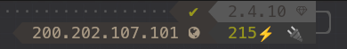

# Nobreak Ts Shara on Ubuntu 20.04 with NUT

[NOBREAK UPS SENOIDAL UNIVERSAL 2200 #4222](https://tsshara.com.br/produto/nobreak-ups-senoidal-universal-2200-2/)

  

## Installation

```bash
sudo apt install nut nut-client nut-server
```

## Configuration

### UDEV

The manufacturer indicates in the specifications that the UPS supports "Intelligent Communication: with USB interface".

After unpacking and turning on the UPS, you can see a new USB device `STMicroelectronics Virtual COM Port`.

In my case with vendor id **0483** and product id **5740**.

```bash
Bus 003 Device 018: ID 0483:5740 STMicroelectronics Virtual COM Port
```

```bash
udevadm info -a -n /dev/ttyACM0
```

```
...
    ATTRS{idProduct}=="5740"
    ATTRS{idVendor}=="0483"
    ATTRS{manufacturer}=="STMicroelectronics"
    ATTRS{product}=="STM32 Virtual ComPort"
    ATTRS{serial}=="00000000001A"
...

```

So for the NUT service to be able to use the new serial interface, it is necessary 
to create a rule for the UDEV to change permissions. 
It is also interesting to create a symbolic link so that the interface remains constant.

For this you need to create the file `/etc/udev/rules.d/99-ups-tsshara.rules`

It is important to remember that we can have other devices with the same virtual port controller, 
so it is important to choose a set of attributes that allows differentiating multiple UPSs even 
if they are from the same model and manufacturer.

So I chose three attributes that seem to differentiate each port connected to the computer.

- ATTRS{idProduct}=="5740"
- ATTRS{idVendor}=="0483"
- ATTRS{serial}=="00000000001A"

The symbolic link ensures that the port name is always the same, which will facilitate NUT configuration.

```bash
SUBSYSTEM=="tty",ATTRS{idVendor}=="0483",ATTRS{idProduct}=="5740",ATTRS{serial}=="00000000001A",GROUP="nut",OWNER="root",MODE="0664",SYMLINK+="ttyTSSHARA0"
```

```bash
sudo udevadm control --reload
sudo udevadm trigger
```

After that, it is necessary to verify that the settings worked and that 
the permissions were applied, in addition, the symbolic link must have been created.

```bash
ls -l /dev/ttyACM0
crw-rw---- 1 root nut 166, 0 mai 27 16:29 /dev/ttyACM0

ls -l /dev/ttyTSSHARA0
lrwxrwxrwx 1 root root 7 mai 27 14:49 /dev/ttyTSSHARA0 -> ttyACM0
```

### NUT

After installation it is necessary to change some files so that the NUT recognizes and can communicate with Ts Shara.
Below all the files that have been changed to allow the operation.

- [nut.conf](etc/nut/nut.conf)
- [ups.conf](etc/nut/ups.conf)
- [upsd.users](etc/nut/upsd.users)
- [upsmon.conf](etc/nut/upsmon.conf)
- [upssched.conf](etc/nut/upssched.conf)

Choosing the driver and its configuration is one of the most important steps.

In the etc/nut/ups.conf file we configure the driver and the port created by UDEV.

```toml
maxretry = 3

[tsshara]
  driver = "blazer_ser"
  port = "/dev/ttyTSSHARA0"
  desc = "TS Shara"
  default.battery.voltage.high = "26.00"
  default.battery.voltage.low = "20.80"
  default.battery.voltage.nominal = "24.00"
  runtimecal = "3600,100,7200,50"  
``` 

## Verify Driver configuration

Start the driver.

```bash
sudo upsdrvctl start
```

## UPSD configuration

Configure the file [upsd.users](etc/nut/upsd.users), I didn't have to change anything in the file
`/etc/nut/upsd.conf`.

```
[upsmon]
  password = "<PASSWORD>"
  upsmon master
  actions = SET
  instcmds = ALL
``` 

```bash
sudo systemctl start nut-server.service

sudo systemctl status nut-server.service

sudo systemctl enable nut-server.service

```

If the service goes up correctly, it is already possible to consult the status of the UPS.

**$ upsc tsshara**

```bash

Init SSL without certificate database
battery.charge: 100
battery.voltage: 27.00
battery.voltage.high: 26.00
battery.voltage.low: 20.80
battery.voltage.nominal: 24.0
device.mfr: TS SHARA 221011
device.model: Senoid  22
device.type: ups
driver.name: blazer_ser
driver.parameter.pollinterval: 2
driver.parameter.port: /dev/ttyTSSHARA0
driver.parameter.synchronous: no
driver.version: 2.7.4
driver.version.internal: 1.57
input.current.nominal: 100.0
input.frequency: 60.0
input.frequency.nominal: 60
input.voltage: 208.0
input.voltage.fault: 208.0
output.voltage: 121.0
ups.beeper.status: enabled
ups.delay.shutdown: 30
ups.delay.start: 180
ups.firmware: V010201010
ups.load: 8
ups.mfr: TS SHARA 221011
ups.model: Senoid  22
ups.status: OL
ups.temperature: 24.0
ups.type: offline / line interactive
```
## UPSMON Configuration

Add the lines below to the file `/etc/nut/upsmon.conf`

```
MONITOR tsshara@localhost 1 upsmon "<PASSWORD>" master
NOTIFYFLAG ONBATT SYSLOG+WALL+EXEC
NOTIFYFLAG ONLINE SYSLOG+WALL+EXEC
```

```
MINSUPPLIES 1
SHUTDOWNCMD "/sbin/shutdown -h +0"
POLLFREQ 5
POLLFREQALERT 5
HOSTSYNC 15
DEADTIME 15
POWERDOWNFLAG /etc/killpower
RBWARNTIME 43200
NOCOMMWARNTIME 300
FINALDELAY 5
MONITOR tsshara@localhost 1 upsmon "<PASSWORD>" master
NOTIFYFLAG ONBATT SYSLOG+WALL+EXEC
NOTIFYFLAG ONLINE SYSLOG+WALL+EXEC
```

It is necessary to start and activate the service.

```bash
sudo systemctl start nut-monitor.service

sudo systemctl enable nut-monitor.service
```

## Enable NUT after reboot

```bash
sudo systemctl enable nut.target

sudo systemctl enable nut-driver.target
```

```bash
sudo systemctl status nut-driver.target
nut-driver.target - Network UPS Tools - target for power device drivers on this system
     Loaded: loaded (/lib/systemd/system/nut-driver.target; enabled; vendor preset: enabled)
     Active: active since Mon 2023-05-29 10:58:06 -03; 2h 29min ago

sudo systemctl status nut.target
nut.target - Network UPS Tools - target for power device drivers, data server and monitoring client (if enabled) on this system
     Loaded: loaded (/lib/systemd/system/nut.target; enabled; vendor preset: enabled)
     Active: active since Mon 2023-05-29 10:58:09 -03; 2h 29min ago
```

## "Oh My ZSH!" and Powerlevel10k

I use ["Oh My ZSH!"](https://ohmyz.sh/) in my day to day with the [Powerlevel10k](https://github.com/romkatv/powerlevel10k) 
theme and I decided to try to create a custom prompt with some UPS information.



Below is the function I added to the `~/.p10k.zsh` file and the configuration to add the new prompt.

```zsh
  typeset -g POWERLEVEL9K_RIGHT_PROMPT_ELEMENTS=(
    # =========================[ Line #1 ]=========================
    ...
    my_ups                  # show UPS input voltage and battery charge if no power
  )

  typeset -g POWERLEVEL9K_MY_UPS_BACKGROUND=237
  # Aneel Resolution No. 505/2001 – National Electric Energy Agency
  # establishes limits of 201 to 231 V (for phase-to-neutral voltage) for the
  # electricity supply by concessionaires in Brazil,
  # considering nominal value of 220/380V, three-phase.
  # Maximum: 231V
  # Average: 216V
  # Minimum: 201V  
  function prompt_my_ups() {
    integer input_voltage="$(upsc tsshara input.voltage 2>/dev/null)"
    # No power
    if (( input_voltage <= 1 )); then
      integer battery_charge="$(upsc tsshara battery.charge 2>/dev/null)"
      p10k segment -f red -i '🔌' -t "${battery_charge}🔋"
      return 0
    fi
    if (( input_voltage < 201 || input_voltage > 231 )); then
      p10k segment -f red -i '🔌' -t "${input_voltage}⚡"
    elif (( input_voltage < 209 || input_voltage > 220 )); then
      p10k segment -f yellow -i '🔌' -t "${input_voltage}⚡"
    else
      p10k segment -f green -i '🔌' -t "${input_voltage}⚡"
    fi
  }
```
## Other Models

[Nobreak 1.5Kva Ts Shara 4438 Ups 8 Tomadas E.Biv S.Chaveado](https://tsshara.com.br/produto/nobreak-ups-senoidal-universal-1500va-novo-design/?gclid=Cj0KCQjw98ujBhCgARIsAD7QeAg8e9vtDRaCtPpG8RoNwE9VNdTUkajAgu34aJDS-Z20pqZvDqlBCZgaAtd5EALw_wcB)

I had the opportunity to also install and test the Ts Shara 4438 model on 
Ubuntu 22.04 and it worked perfectly using the same BLAZER_SER driver.

I started noticing some messages like 'stale' when trying to get the status of the UPS, 
after some research I found the link [NUT & CyberPower UPS](https://nmaggioni.xyz/2017/03/14/NUT-CyberPower-UPS/) 
and decided to test these settings on the equipment. 
Let's see if the result will be successful...

Update Jun 2023: I still have stale errors so I'm going to test the driver [nutdrv_qx](https://networkupstools.org/docs/man/nutdrv_qx.html) 
to see if the problem goes away

**/etc/nut/ups.conf**

```toml
[tsshara]
  driver = "nutdrv_qx"
  port = "/dev/ttyTSSHARA0"
  default.battery.voltage.high = "26.00"
  default.battery.voltage.low = "20.80"
  default.battery.voltage.nominal = "24.00"
  runtimecal = "1800,100,3600,50"
  desc = "TS Shara"
  protocol = "megatec"
  pollinterval = 15
```  

```
/etc/nut/ups.conf
[tsshara]
  ...
  pollinterval = 15

/etc/nut/upsmon.conf
  ...
  DEADTIME 25
```

## Links and References

[Arch APC UPS](https://wiki.archlinux.org/title/APC_UPS)

[Arch Network UPS Tools](https://wiki.archlinux.org/title/Network_UPS_Tools)

[BLAZER_SER(8)](https://networkupstools.org/docs/man/blazer_ser.html)

[Notes on securing NUT](https://networkupstools.org/historic/v2.7.4/docs/user-manual.chunked/ar01s09.html)

[Network UPS Tools Overview](https://networkupstools.org/docs/user-manual.chunked/ar01s02.html#_configuring_and_using)

[Network UPS Tools (NUT)](https://networkupstools.org/)

[Utilizando NUT para controle de Nobreak TS SHARA com Raspberry](http://mylowtechstuff.blogspot.com/2018/02/utilizando-nut-para-controle-de-nobreak.html)

[Ubuntu 18.04 + Nobreak Ts shara USB](https://github.com/rbernardes/tsshara-ubuntu-server)

[How do I allow a non-default user to use serial device ttyUSB0?](https://askubuntu.com/questions/112568/how-do-i-allow-a-non-default-user-to-use-serial-device-ttyusb0)

[udev re-numbering when creating symlinks](https://unix.stackexchange.com/questions/79087/udev-re-numbering-when-creating-symlinks)

[UDEV rules, "NAME" variable not working](https://askubuntu.com/questions/920098/udev-rules-name-variable-not-working)

[SUSE Dynamic Kernel Device Management with udev](https://documentation.suse.com/sles/12-SP4/html/SLES-all/cha-udev.html)

[ANEEL Resolution 505/2001: Quality Improvement](https://www.cgti.org.br/publicacoes/wp-content/uploads/2016/01/Resoluc%CC%A7a%CC%83o-505_2001-ANEEL-Melhoria-da-Qualidade.pdf)
