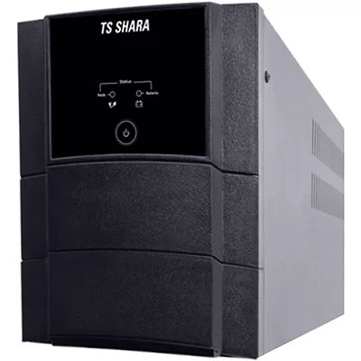
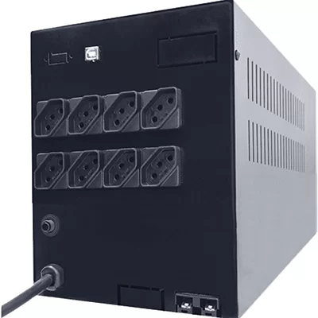

# Nobreak Ts Shara on Ubuntu 20.04 with NUT

[NOBREAK UPS SENOIDAL UNIVERSAL 2200 #4222](https://tsshara.com.br/produto/nobreak-ups-senoidal-universal-2200-2/)

  

## Installation

```bash
sudo apt install nut
```

## Configuration

The manufacturer indicates in the specifications that the UPS supports "Intelligent Communication: with USB interface".

After unpacking and turning on the UPS, you can see a new USB device `STMicroelectronics Virtual COM Port`.

In my case with vendor id **0483** and product id **5740**.

```bash
Bus 003 Device 018: ID 0483:5740 STMicroelectronics Virtual COM Port
```

So for the NUT service to be able to use the new serial interface, it is necessary 
to create a rule for the UDEV to change permissions. 
It is also interesting to create a symbolic link so that the interface remains constant.

For this you need to create the file `/etc/udev/rules.d/99-ups-tsshara.rules`

```bash
SUBSYSTEM=="tty",ATTRS{idVendor}=="0483",ATTRS{idProduct}=="5740",GROUP="nut",OWNER="nut",MODE="0660",SYMLINK+="ttyTSSHARA"
```

```bash
sudo udevadm control --reload
sudo udevadm trigger
```

After that, it is necessary to verify that the settings worked and that 
the permissions were applied, in addition, the symbolic link must have been created.

```bash
ls -l /dev/ttyACM0
crw-rw---- 1 nut nut 166, 0 mai 27 16:29 /dev/ttyACM0

ls -l /dev/ttyTSSHARA
lrwxrwxrwx 1 root root 7 mai 27 14:49 /dev/ttyTSSHARA -> ttyACM0
```
